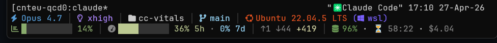

# cc-vitals



A statusline for Claude Code that puts your model, cost, git state, and
prompt-cache health at a glance. Multi-line, themeable, and renders either
inside CC (default) or in your tmux status bar (smooth ticking countdown,
multi-CC routing).

## Quick start

In Claude Code:

```
/plugin marketplace add Teutooni/cc-vitals
/plugin install cc-vitals
/cc-vitals install
```

Restart CC. The default config matches the screenshot above.

Requires Python 3.8+ and a Nerd Font in your terminal (or set
`"icons": "ascii"` if your font has no glyphs).

To update later: `/plugin marketplace update cc-vitals-marketplace` then
`/plugin install cc-vitals` again.

## Configure

Most adjustments are one slash command:

- `/cc-vitals` — interactive wizard
- `/cc-vitals preset <vs-dark-modern|high-contrast|claude-default>` — switch theme
- `/cc-vitals toggle <segment>` — add/remove a segment from line 1
- `/cc-vitals mode <native|tmux>` — switch rendering mode (see below)
- `/cc-vitals show` — print effective config + live preview
- `/cc-vitals edit` — open `~/.claude/statusline.json` for full control
- `/cc-vitals uninstall` — remove the `statusLine` entry from settings

For deeper control, edit `~/.claude/statusline.json` directly. User config
is **deep-merged** over the shipped defaults — only override what you care
about:

```json
{
  "theme": "vs-dark-modern",
  "icons": "nerd",
  "lines": [
    ["model", "cwd", "git"],
    ["env", "cost", "context"]
  ],
  "segments": {
    "cwd":  { "max_length": 40 },
    "cost": { "show_session": true, "show_day": true, "show_month": true }
  },
  "colors": {
    "model": "accent",
    "git.dirty": "warning"
  }
}
```

## Rendering modes

| Aspect              | `native` (default)                          | `tmux`                                          |
|---------------------|---------------------------------------------|-------------------------------------------------|
| Renderer            | CC re-renders on every event                | tmux at `status-interval 1`                     |
| Cache TTL display   | `HH:mm` wall-clock expiry (minute-grained)  | `mm:ss` countdown ticking every second          |
| Extra dependencies  | none                                        | `tmux ≥ 3.2`                                    |
| Multi-CC routing    | n/a (one CC per CC)                         | one tmux session per CC, slot-routed via `cct`  |
| Setup cost          | zero                                        | ~5 min: install tmux, source the snippet        |

Switch with `/cc-vitals mode tmux` (or `mode native`).

### Tmux mode setup

Run `/cc-vitals mode tmux`, then launch CC through the `cct` wrapper:

```sh
cct                        # fresh CC in a fresh tmux session
cct -r <session-id>        # resume a CC session
cct --resume               # interactive picker
cct --model opus           # any flag claude accepts
```

`cct` runs tmux on its own dedicated socket (`-L cc-vitals`) loading the
plugin's static config (`tmux/cc-vitals.tmux.conf`). That keeps the
cc-vitals tmux server fully **isolated from your personal `~/.tmux.conf`**
— no edits required, no risk of conflicting with your existing
keybindings or status bar.

The wrapper is at `$CLAUDE_PLUGIN_ROOT/bin/cct` — symlink it into PATH or
paste this into `~/.bashrc`:

```sh
cct() { "$CLAUDE_PLUGIN_ROOT/bin/cct" "$@"; }
```

Several `cct` instances can run side by side, each with its own
randomized 8-hex slot and its own status bar.

#### Producer / consumer split

`ingest.py` (running wherever CC runs) renders the full statusline at
each CC event and publishes a per-line manifest to
`$CC_VITALS_DUMP_DIR/<slot>.line<n>.json`. `tick.py` (running on the host
under tmux's 1 Hz `status-format` substitution) reads the manifest and
emits already-rendered tmux markup; the only piece formatted live is the
cache TTL countdown (so it ticks smoothly without re-rendering the rest
of the line). All other state — transcript paths, theme machinery, cache
totals — lives entirely on the producer side.

This split makes the host/container case trivial:

```sh
# Bind-mount the published-manifest directory into the container, then
# launch CC inside it through cct:
docker run --rm -d --name myctr \
  -v ~/.claude/plugin-data/cc-vitals/published:/cc-vitals-published \
  -e CC_VITALS_DUMP_DIR=/cc-vitals-published \
  myimage sleep infinity

cct --exec 'docker exec -it -e CC_VITALS_SLOT="$CC_VITALS_SLOT" \
    -e CC_VITALS_DUMP_DIR=/cc-vitals-published myctr claude'
```

The plugin must be installed on **both** sides (host runs `tick.py`,
container runs `ingest.py`). They share only the bind-mounted manifest
directory — no shared cache state, no host/container drift.

#### Personal tmux config (advanced, optional)

Because `cct` uses `-L cc-vitals -f`, your `~/.tmux.conf` is **not**
sourced inside the cc-vitals tmux session. If you want your keybindings,
copy-mode prefs, etc., uncomment the last line of
`$CLAUDE_PLUGIN_ROOT/tmux/cc-vitals.tmux.conf`:

```tmux
source-file -q ~/.tmux.conf
```

Skip this if you're not sure — everything else works without it.

---

# Reference

## Segments

`model`, `effort`, `cwd`, `git`, `env`, `cost`, `cost-day-forecast`,
`cost-month-forecast`, `context`, `limits`, `tokens`, `tokens-session`,
`cache`, `duration`, `runtime`, `cc-version`. (`cost-avg` is a legacy alias
for `cost-day-forecast`.)

Notable behaviors:

- **`git`** — branch, dirty marker, ahead/behind, upstream, worktree, plus
  in-progress-op badges (merge / rebase with step/total / cherry-pick /
  revert / bisect). Cached per-cwd, fingerprinted by `.git/HEAD` and
  `.git/index` mtimes; falls back to the previous result if `git status`
  exceeds `segments.git.timeout` (3.0s default). On WSL→NTFS or other
  slow filesystems, a ⏳ slow marker surfaces if there's no cache yet.
- **`limits`** — overlays the 5-hour and 7-day subscription usage windows
  in a single bar (5-hour fill takes precedence on overlap).
- **`tokens`** — last-turn `↑fresh-input ↓output +cache-creation`.
  `tokens-session` shows cumulative `Σ ↑in ↓out`.
- **`cache`** — see *Cache health* below.
- **`runtime`** — shells out to `node`/`python3`/`rustc`/etc. on every
  render. Bounded at 0.5s per probe but adds latency; off by default.

## Themes

| Name              | Feel                                              |
|-------------------|---------------------------------------------------|
| `vs-dark-modern`  | VS Code Dark Modern (default) — cool blues/greys  |
| `high-contrast`   | Accessibility-first, bright on black              |
| `claude-default`  | Claude brand orange accent on warm neutrals       |

Override any token with a hex color:

```json
{ "theme": { "accent": "#D97757", "primary": "#E5E5E5" } }
```

A custom palette must define `primary`, `secondary`, `accent`, `muted`,
`warning`, `error`, `success`, `dim`.

## Cost tracking

- **Session** from CC's `cost.total_cost_usd`.
- **Day / Month** aggregated locally in
  `~/.claude/plugin-data/cc-vitals/costs.json` from per-session deltas
  between consecutive renders. Safe across resumes and restarts — never
  double-counts. Rolls over at local midnight (daily) and start of
  calendar month. Pruned to 90 days / 24 months / 200 sessions.
- **`cost-day-forecast`** / **`cost-month-forecast`** — projected totals
  using a rolling 7-day average (tunable via
  `segments.cost_day_forecast.window` / `cost_month_forecast.window`).

## Cache health

The `cache` segment shows hit ratio · TTL · estimated $ at risk on miss.

- **Hit ratio** is rolled up across every assistant turn in the session
  (`Σcache_read / Σ(cache_read + input_tokens + cache_creation)`).
  Per-turn ratios are misleading because CC cache-controls nearly all
  input, leaving `input_tokens` ≈ 0.
- **TTL tier** (5-min vs 1-hour) is auto-detected from the latest turn's
  usage breakdown. New CC installs default to 5-min; older installs may
  still be on 1-hour. The glyph tier ⏳ ok → ⏰ alert → ⚠ warn → ⚠ expired
  scales with the detected tier; tune via
  `segments.cache.ttl_alert_seconds` / `ttl_warn_seconds` (a single
  number for both tiers, or `{"1h": N, "5m": M}` to split).
- **Expiry clock** follows the system timezone. Override via
  `segments.cache.timezone` — accepts an IANA name
  (`"America/Los_Angeles"`, needs Python 3.9+ `zoneinfo`), a fixed offset
  (`"+05:30"`), `"UTC"`, or `"local"`.
- A `PostToolUse` hook bumps a per-session marker on every tool call so
  the expiry clock stays accurate during long agent turns when the
  transcript mtime would otherwise lag the API requests.

Don't set a `refreshInterval` on the `statusLine` block — sub-second
polling corrupts CC's TUI, and neither rendering mode needs it (native
re-renders event-driven; tmux owns its own 1 Hz loop).

## Environment detection

Detects in order: Docker (`/.dockerenv`), Kubernetes (env var), WSL
(`/proc/version`), virtualization (`systemd-detect-virt`), then native
OS.

## Debugging

| Variable                | Effect                                                         |
|-------------------------|----------------------------------------------------------------|
| `CC_VITALS_DEBUG=1`     | re-raise segment exceptions instead of rendering blank         |
| `CC_VITALS_THEME=<name>`| override theme for the current process                         |
| `CC_VITALS_DUMP=1`      | (native mode) write raw CC stdin to `~/.claude/plugin-data/cc-vitals/last-stdin.json` |
| `CC_VITALS_DUMP_DIR`    | (tmux mode) override where ingest publishes manifests; defaults to `~/.claude/plugin-data/cc-vitals/published/`. Set this to a bind-mounted path to bridge a container/host boundary. |
| `CC_VITALS_SLOT`        | (tmux mode) per-CC routing key. Set automatically by the `cct` wrapper to `<cwd-basename>-<8-hex>`; tmux uses `#{session_name}` to read the matching manifest. Set explicitly when running outside `cct`. |

The native-mode dump may include session-identifying data (transcript
path, session id) — delete when done. To inspect a tmux-mode published
manifest: `cat ~/.claude/plugin-data/cc-vitals/published/<slot>.line0.json | jq .`.

## Tests

```sh
python3 -m unittest discover -s tests
```

Standard library only — no external dependencies.

## Uninstall

```
/cc-vitals uninstall
```

Removes the `statusLine` key from `~/.claude/settings.json`. Your config
(`~/.claude/statusline.json`) and cost history
(`~/.claude/plugin-data/cc-vitals/`) remain; delete manually if you no
longer want them.

## License

MIT
